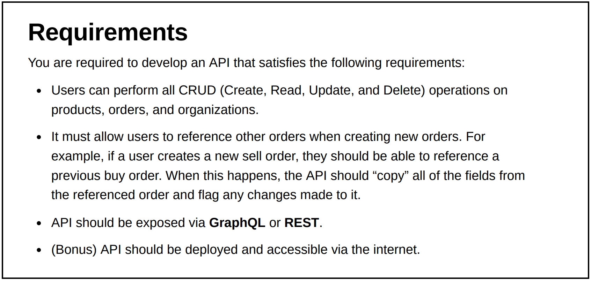

# Farmlend OMS Service

[](https://github.com/naeemark/farmlend-oms-service/actions/workflows/publish.yaml)
[](https://github.com/naeemark/farmlend-oms-service/actions/workflows/build.yaml)
[](https://sonarcloud.io/dashboard?id=naeemark_farmlend-oms-service)
[](https://sonarcloud.io/dashboard?id=naeemark_farmlend-oms-service)
[](https://img.shields.io/docker/automated/naeemark/farmlend-oms-service)

Demonstration of Requirements understanding, proposing a solution and implementation by using the required tools and techniques.

---

- [Distribution](#distribution)
  - [Swagger APi-Docs](#swagger-api-docs)
  - [What is this repository for](#what-is-this-repository-for)
- [Problem Statement](#problem-statement)
- [Proposed Solution](#proposed-solution)
  - [Entities](#entities)
- [Deliverable Content](#deliverable-content)
  - [Functional Implementation](#functional-implementation)
  - [Non-Functional Implementation](#non-functional-implementation)
- [Development Cycle](#development-cycle)
- [How to Setup](#how-do-i-get-set-up)
  - **[<< Docker Compose >>](#docker-compose)**
  - [Developer Setup](#developer-setup)
  - [Configuration](#configuration)
    - [Installation](#installation)
    - [Running the app](#running-the-app)
    - [Lint](#lint)
    - [Test](#test)
    - [Docker Build](#build-docker-image)
    - [Docker Run](#run-docker-image)
    - [Docker Run from Registry](#run-docker-image-from-docker-hub)
    - [Docker Stop](#stop-docker-container)
- [Pre-reqs](#pre-reqs)
- [Tools Included](#tools-included)
- [External Tools](#external-tools)
- [Deployments](#deployment)
- [Contribute](#contribution-guidelines)

---

## Distribution

- **[Swagger API Docs - Deployed on EC2 Instance](http://ec2-54-93-103-83.eu-central-1.compute.amazonaws.com/api-docs)** - **Bonus Requirement**
- A [docker repository](https://hub.docker.com/repository/registry-1.docker.io/naeemark/farmlend-oms-service) is created, the latest image can be downloaded
- **[Sonar Project](https://sonarcloud.io/dashboard?id=naeemark_farmlend-oms-service)** - **Bonus Requirement**
- **[Docker Compose](docker-compose.yaml)** - **Bonus Requirement**
- [Postman Collection Link](https://www.dropbox.com/s/xw4arcs5fuirlo0/Farmlend%20OMS.postman_collection.json?dl=0)

---

### Swagger APi-Docs

- [Live Link](http://ec2-54-93-103-83.eu-central-1.compute.amazonaws.com/api-docs)

---

### What is this repository for

- This app is built as assignment for Farmlend.
- Adds different libs to enhance the application quality and performance.
- Using [SWAGGER.IO](www.swagger.io) for documentation and as a working REST-API client
- CI/CD Demonstration using [Github Actions](https://github.com/features/actions)
- Docker containers are used for Build Deployment
- The live environment is established on an EC2 instance to run dockerized build
- Version 1.0.0

---

### Problem Statement:



---

### Proposed Solution:

- As per the provided instructions, I would prefer to use a [NestJS](https://docs.nestjs.com/) application for the implementation of required functionality.
- As demanded, a `Postgres` Database will be used for data persistence.
- For testing, I would prefer to use in-built framework in [NestJS](https://docs.nestjs.com/)
- `Typescript` linting tools like `eslint` and `prettier` will be used along with `husky`
- There will be a Dockrized Build distribution
- A recomended ORM will be used i.e `TypeORM`
- For demonstration purpose, an API frontend should be provided...i.e Swagger
- A postman collection will also be prepared as part of distribution.

#### Entities

- As per the given statement, there will be three main entities
- I would like to use database constraints to avoid deletion of account which is used as a reference in some transaction
- It is also noted that there is a possible `cicular dependency` between the mention entities, to resolve this, there might be a need of `linking tables`

### Deliverable Content

#### Functional Implementation

- **POST** `{baseURL}/api/v1/products` - creates a new product
- **GET** `{baseURL}/api/v1/products/{id}` - Returns a product
- **GET** `{baseURL}/api/v1/products` - Returns all products
- **PATCH** `{baseURL}/api/v1/products/{id}` - Updates a product
- ## **DELETE** `{baseURL}/api/v1/products/{id}` - Delete a product

#### Non-Functional Implementation

- **GET** `{baseURL}/api` - Checks the health of the system

### Development Cycle:

- Distributes the whole development into Small tasks
- [Each Issue](https://github.com/naeemark/farmlend-oms-service/issues?q=is%3Aissue) shows a feature
- [Each commit](https://github.com/naeemark/farmlend-oms-service/commits/main) shows a small progress
- [Pull Requests](https://github.com/naeemark/farmlend-oms-service/pulls?q=is%3Apr+is%3Aclosed) are done for major tasks

## How do I get set up?

### << Docker Compose >>

To run the project locally using docker;

- `docker compose up --detach --wait`

To tear down:

- `docker compose down --remove-orphans`

### Developer Setup

To setup the project locally you need to clone this repo, from `main` branch or some latest `TAG`

```bash
# copy .env file from .env.example
$ cp .env.example .env
```

### Configuration

This project is a [Nest](https://github.com/nestjs/nest) framework TypeScript repository.

### Installation

```bash
$ yarn install
```

### Running the app

```bash
# development
$ yarn run start

# watch mode
$ yarn run start:dev

# production mode
$ yarn run start:prod
```

### Lint

```bash
# lint check
$ yarn lint

# lint fix
$ yarn lint:fix
```

### Test

```bash
# unit tests
$ yarn test

# e2e tests
$ yarn test:e2e # (WIP)

# test coverage
$ yarn test:cov
```

#### Build Docker Image

- `docker build -t farmlend-oms-service .`

#### Run Docker Image

- Run `docker run -d -p 80:3000 farmlend-oms-service`
- You may access the running docker app on [`http://localhost/api-docs`](http://localhost/api-docs)

#### Run Docker Image From Docker hub

- **[Docker Image Repository](https://hub.docker.com/repository/docker/naeemark/farmlend-oms-service)**
- Run `docker run -d --name farmlend-oms-service -p 80:3000 naeemark/farmlend-oms-service`
- You may access the running docker app on [`http://localhost/api-docs`](http://localhost/api-docs)

#### Stop Docker Container

- Run `docker kill {container-id}`

### Pre-reqs

- node v16+
- nestjs
- Docker
- Postgres:v14
- jest
- huskey
- VS Code

### Tools Included

- sonar-scanner
- Sonar
- Swagger
- TypeORM
- Joi
- Github Actions
- EC2 Instance for deployment

#### Auth

- No auth system is included in this solution

## External Tools:

- **[Github Actions](https://github.com/features/actions)**
- **[Docker](https://www.docker.com/)**
- **[SonarCould](https://sonarcloud.io/)**

## Deployment

- When a `pull request` is merged in `master`, `Github Action` starts and following steps are done by automated CI/CD:
  - Creates Environment and Runs all tests
  - Complete a SonarQube analysis and pushes the results to **[Live Project](https://sonarcloud.io/dashboard?branch=develop&id=naeemark_farmlend-oms-service)**
  - Makes a deployment to Github packages (Mock)
  - Creates the Docker Image and pushes to [Docker Repository](https://hub.docker.com/repository/registry-1.docker.io/naeemark/farmlend-oms-service)

**_- As a next step, it is deployed manually in an ec2 instance._**

## Contribution guidelines

- Forks are always appreciated
